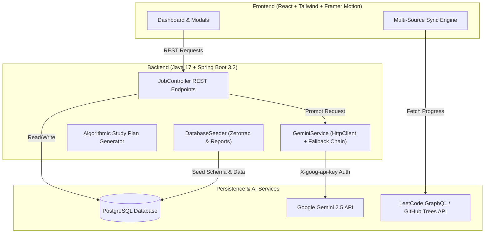

<div align="center">

# 🎯 PrepIntel
### **AI-Powered Technical Interview Intelligence & Study Engineering Platform**

[](https://www.oracle.com/java/)
[](https://spring.io/projects/spring-boot)
[](https://www.postgresql.org/)
[](https://reactjs.org/)
[](https://tailwindcss.com/)
[](https://deepmind.google/technologies/gemini/)
[](LICENSE)

<br/>

**PrepIntel** is a high-performance placement preparation platform designed to help candidates prepare for technical interviews with data precision. It aggregates real-world interview report data across **84+ top companies** (from Google and Amazon to TCS, Infosys, and Cognizant), incorporates 1,980+ Zerotrac Elo problem difficulty ratings, and features a resilient Gemini AI Coach.

[Features](#-key-features) • [Architecture](#-system-architecture) • [Getting Started](#-getting-started) • [Bug Log](#-technical-bug-log)

</div>

---

## ✨ Key Features

### 🏢 **1. Company War Rooms & Frequency Ranking**
- Select target companies to view exact historical LeetCode interview questions.
- Ranked by **Most Asked Frequency** and categorized by interview round (Online Assessment, Technical Round 1/2, HR).
- Filter 1,000+ problems in real-time with **0ms UI lag** using `useMemo` React hooks.

### 📈 **2. Zerotrac Contest Elo Difficulty Ratings**
- Replaces generic "Easy / Medium / Hard" tags with precise LeetCode contest Elo ratings (e.g. *1540 Elo*).
- Enables candidates to target questions matching exact skill boundaries.

### 🧠 **3. Resilient Gemini 2.5 AI Coach & Hints**
- **AI Interview Coach**: Generates structured, high-yield preparation overviews detailing OA format, target focus areas, and recommended prep time.
- **AI Hint Coach**: Provides progressive, step-by-step conceptual hints without spoiling code.
- **Resilience Architecture**: Features exponential retry backoff and a 2-tier fallback chain (`gemini-2.5-flash` → `gemini-2.5-flash-lite`) to guarantee high availability under free-tier traffic load spikes.

### 📅 **4. Algorithmic Study Plan Generator**
- Enter your target exam date and daily available study hours.
- A deterministic Java algorithm filters out your solved problems, splits unsolved questions by difficulty, and builds a customized day-by-day roadmap.

### 🔄 **5. Multi-Source Tokenless Sync Engine**
- **LeetCode GraphQL API**: Imports public Accepted (AC) submissions without requiring password authentication.
- **GitHub Git Trees API**: Recursively scans repositories (`/git/trees/{branch}?recursive=1`) to import solved slugs synced via LeetHub/LeetSync.
- **Codeforces API**: Live sync of solved competitive programming problems.

---

## 🏗️ System Architecture



---

## 🛠️ Technology Stack

| Domain | Technologies Used |
| :--- | :--- |
| **Frontend** | React 18, Tailwind CSS, Framer Motion, Lucide Icons, Vite |
| **Backend** | Java 17, Spring Boot 3.2, Spring Data JPA, Java Native `HttpClient` |
| **Database** | PostgreSQL 16 (Indexed foreign keys & composite indexes) |
| **AI Integration** | Google Gemini 2.5 REST API (`gemini-2.5-flash` & `gemini-2.5-flash-lite`) |
| **DevOps / Tooling** | Maven, PowerShell Process Automation, Git |

---

## 🚀 Getting Started

### **Prerequisites**
- Node.js (v18+)
- Java 17+
- PostgreSQL
- Gemini API Key ([Get Key Here](https://aistudio.google.com/))

---

### 1. Database Setup
```sql
CREATE DATABASE prepintel;
```

### 2. Backend Setup
1. Open terminal in the `backend` directory:
   ```bash
   cd backend
   ```
2. Set your PostgreSQL password and Gemini API Key:
   ```powershell
   $env:SPRING_DATASOURCE_PASSWORD="your_postgres_password"
   $env:PREPINTEL_AI_KEY="your_gemini_api_key"
   ```
3. Run the Spring Boot application:
   ```bash
   mvn spring-boot:run
   ```
   *The database will auto-seed 84+ companies, 1,980+ Zerotrac ratings, and interview reports on startup.*

---

### 3. Frontend Setup
1. Open terminal in the `frontend` directory:
   ```bash
   cd frontend
   ```
2. Install dependencies:
   ```bash
   npm install
   ```
3. Launch development server:
   ```bash
   npm run dev
   ```
4. Open **`http://localhost:3000`** in your browser.

---

## 📂 Project Structure

```text
prepintel/
├── backend/
│   ├── src/main/java/com/prepintel/
│   │   ├── controller/      # REST API Endpoints (JobController, SyncController)
│   │   ├── entity/          # JPA Entities (Company, Problem, InterviewReport)
│   │   ├── repository/      # Spring Data Repositories
│   │   └── service/         # GeminiService (AI API & Fallback), DatabaseSeeder
│   └── src/main/resources/
│       ├── application.properties
│       ├── schema.sql       # PostgreSQL DDL with Indexes
│       └── data.sql         # Company & Problem Initial Data
├── frontend/
│   ├── src/
│   │   ├── components/      # UI Cards, Modals, Badges
│   │   ├── Dashboard.jsx    # Core Interactive Intelligence Dashboard
│   │   └── index.css        # Glassmorphism & SaaS Design System
└── BUG_LOG.md               # Technical Troubleshooting & Bug Fix Records
```

---

## 📖 Technical Bug Log

For a detailed breakdown of real technical bugs solved during development (Spring Boot property precedence, LLM 503 resilience, JSON sanitization, and `useMemo` optimizations), see [BUG_LOG.md](BUG_LOG.md).

---

## 📝 License

Distributed under the MIT License. See `LICENSE` for more information.
