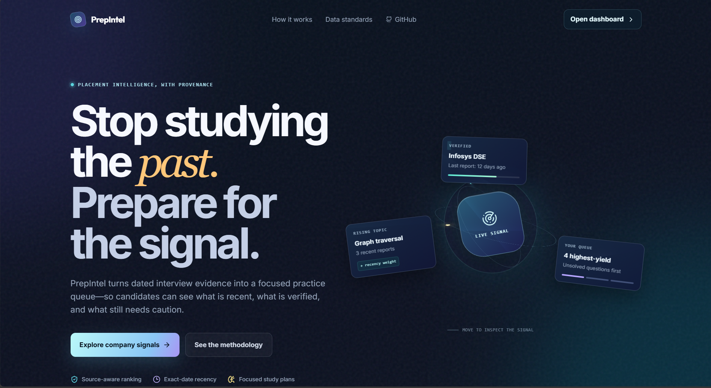
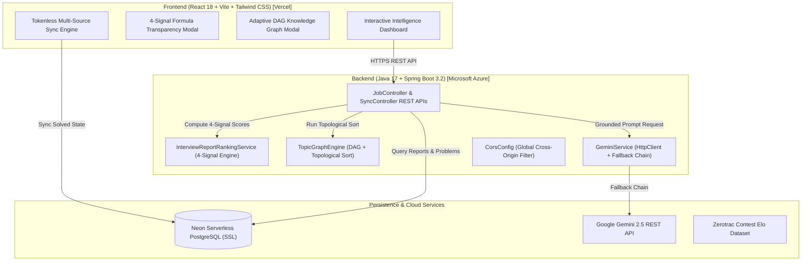

<div align="center">

# 🎯 PrepIntel
### **Data-Driven Placement Intelligence & Technical Interview Platform**

[](https://prepintel-black.vercel.app)
[](https://prepintel-api-hy-djcxgubggng4c5cc.centralindia-01.azurewebsites.net/api/companies)
[](https://neon.tech)
[](https://www.oracle.com/java/)
[](https://spring.io/projects/spring-boot)
[](https://reactjs.org/)
[](https://deepmind.google/technologies/gemini/)

<br/>

<p align="center">
  
</p>

**PrepIntel** is an intelligent placement engineering platform that replaces static question sheets with **data-driven interview analytics**. It ingests historical interview data across **69 top technology companies** (from Google and Amazon to TCS, Infosys, and Cognizant), applies a **4-signal mathematical confidence formula**, and computes **topological learning trajectories** using Directed Acyclic Graphs (DAGs).

[Live Demo](https://prepintel-black.vercel.app) • [System Architecture](#-system-architecture) • [Engineering Mechanics](#-star-engineering-innovations) • [API Reference](#-api-reference) • [Getting Started](#-getting-started)

</div>

---

## 🌟 Star Engineering Innovations

### 🧠 1. Placement Intelligence Engine (vs. Static Sheets)
Traditional company sheets (Striver, NeetCode, static GitHub lists) are unranked CSVs curated months or years ago. PrepIntel operates as an **intelligence platform**:
- Automatically aggregates, normalizes, and deduplicates **19,000+ company-tagged questions**.
- Computes **live frequency ranks**, **recency trends**, and **source provenance** per question.
- Separates verified campus recruiters into a dedicated **Campus Target (8)** track vs. **Extended Practice (61)** set to guarantee data transparency.

---

### 📐 2. 4-Signal Mathematical Confidence Scoring Engine
Instead of arbitrary heuristics or hardcoded percentages, every interview question is evaluated by a **mathematically defensible 4-signal formula**:

$$\text{ConfidenceScore} = 0.40 \cdot S_{\text{freq}} + 0.25 \cdot S_{\text{rec}} + 0.20 \cdot S_{\text{ver}} + 0.15 \cdot S_{\text{div}}$$

Where each signal is normalized to $[0, 1]$ before weighting:

* **$S_{\text{freq}}$ (Log-Normalized Frequency)**:
  $$S_{\text{freq}} = \frac{\ln(1 + \text{reportCount})}{\ln(1 + \max \text{reportCount})}$$
  *Prevents viral outlier questions with 200+ reports from compressing all other questions to 0%.*

* **$S_{\text{rec}}$ (Exponential Recency Decay with 180-Day Half-Life)**:
  $$S_{\text{rec}} = \max_{\text{reports}} \exp\left(-\frac{\text{ageDays}}{180}\right)$$
  *Reflects placement season cycles. A recent question retains ~85% signal strength, while 2-year-old data decays smoothly.*

* **$S_{\text{ver}}$ (Verification Ratio)**:
  $$S_{\text{ver}} = \frac{\text{verifiedReportCount}}{\text{totalReportCount}}$$
  *Measures the proportion of evidence verified by community consensus.*

* **$S_{\text{div}}$ (Normalized Shannon Entropy of Source Distribution)**:
  $$S_{\text{div}} = -\frac{\sum_{i=1}^{N} p_i \ln(p_i)}{\ln(N)}$$
  *Quantifies source diversity. Questions confirmed across multiple independent sources receive higher trust than single-source reports.*

---

### 🌐 3. Adaptive DAG TopicGraphEngine (Topological Sort + Personalization)
DSA prerequisites are modeled as a **Directed Acyclic Graph (DAG)** ($G = (V, E)$). The backend ([`TopicGraphEngine.java`](backend/src/main/java/com/prepintel/service/TopicGraphEngine.java)) runs a **Topological Sort & Multi-Signal Personalization Score**:

$$\text{PriorityScore}(v) = 0.40 \cdot S_{\text{companyFreq}} + 0.30 \cdot S_{\text{userWeakness}} + 0.20 \cdot S_{\text{unlockValue}} + 0.10 \cdot S_{\text{diffFit}}$$

- **Company-Aware Trajectories**: Generates tailored topological study orders (e.g. Amazon prioritizes `Graphs → DP`, while TCS prioritizes `Strings → Arrays`).
- **Unlock Value Metrics**: Calculates downstream nodes unlocked (e.g. `Arrays` unlocks 5 downstream topics: Two Pointers, Sliding Window, Prefix Sum, Hash Table, Sorting).
- **ROI Ratings ($\star\star\star\star\star$)**: Provides estimated study hours and return-on-investment ratings per topic node.

---

### 📈 4. Zerotrac Contest Elo Calibration
- Replaces coarse "Easy / Medium / Hard" tags with **1,980+ LeetCode contest Elo ratings** derived from Zerotrac data (e.g. *1540 Elo*).
- Enables candidates to calibrate preparation against exact skill boundaries.

---

### 🤖 5. Resilient Multi-Tier Gemini 2.5 AI Coaching
- **AI Summary Coach**: Generates company-level focus area summaries, OA pattern overviews, and target preparation timelines.
- **AI Hint Coach**: Provides progressive, step-by-step conceptual hints without spoiling solution code.
- **High-Availability Fallback Chain**: Implements exponential backoff and a 2-tier fallback chain (`gemini-2.5-flash` → `gemini-2.5-flash-lite`) with context-informed offline fallbacks.

---

### 🔄 6. Tokenless Multi-Source Sync Engine
- **LeetCode GraphQL API**: Syncs public Accepted (AC) submissions without needing passwords.
- **GitHub Git Trees API**: Recursively scans repositories (`/git/trees/{branch}?recursive=1`) to import solved problem slugs synced via LeetHub/LeetSync.
- **Codeforces API**: Live sync of competitive programming submissions.

---

## 🏗️ System Architecture



---

## 🔍 Precise Engineering Terminology Boundary

To maintain technical credibility during interviews and architecture reviews, PrepIntel explicitly separates **Deterministic Algorithms & Graph Theory** from **Generative AI LLM Services**:

| Subsystem | Underlying Engineering Mechanics | Accurate Terminology |
|---|---|---|
| **Question Confidence Engine** | 4-Signal Formula: Log-Normalized Frequency, Exponential Decay ($T_{1/2}=180\text{d}$), Verification Ratio, Shannon Entropy | **Mathematical Scoring Formula** *(Deterministic Statistics)* |
| **Topic Learning Order** | Directed Acyclic Graph (DAG) + Topological Sort + Out-Degree Unlock Counting | **Topological Graph Engine** *(Graph Algorithms)* |
| **Difficulty Calibration** | 1,980+ LeetCode Contest Elo Mappings derived from Zerotrac Data | **Objective Contest Elo Rating** *(Data Calibration)* |
| **Study Schedule Planner** | Interleaved Difficulty Distribution & Filter Allocation Algorithm | **Deterministic Schedule Planner** *(Algorithmic Allocation)* |
| **Company Overviews & Hints** | Google Gemini 2.5 REST API with 2-Tier Fallback (`flash` → `flash-lite`) | **Generative LLM AI Coach** *(Generative AI)* |

---

## 🔌 API Reference

| Method | Endpoint | Description |
|---|---|---|
| `GET` | `/api/companies` | Returns all companies with problem counts and OA patterns |
| `GET` | `/api/companies/{slug}/problems` | Returns frequency-ranked problems with 4-signal confidence scores |
| `GET` | `/api/companies/{slug}/stats` | Returns difficulty distribution and top topic trends |
| `POST` | `/api/companies/{slug}/personalized-graph` | Computes dynamic DAG knowledge graph with unlock values & ROI stars |
| `GET` | `/api/companies/{slug}/ai-summary` | Returns AI-generated interview focus areas & preparation overview |
| `POST` | `/api/sync/github` | Scans public GitHub repositories for LeetHub synced problem files |
| `GET` | `/api/sync/leetcode` | Fetches recent accepted submissions via public LeetCode GraphQL |
| `GET` | `/api/problems/{id}/hint` | Fetches progressive conceptual AI hint for a problem |

---

## 🛠️ Technology Stack & Deployments

| Domain | Technologies Used | Live Production Hosting |
|---|---|---|
| **Frontend** | React 18, Vite, Tailwind CSS, Framer Motion, Lucide React | **Vercel** (`prepintel-black.vercel.app`) |
| **Backend** | Java 17, Spring Boot 3.2, Spring Data JPA, Java Native `HttpClient` | **Microsoft Azure App Service** (Linux / Java 17) |
| **Database** | PostgreSQL 18 with HikariCP Connection Pooling | **Neon Serverless PostgreSQL** (SSL) |
| **AI Integration** | Google Gemini 2.5 REST API (`gemini-2.5-flash` & `gemini-2.5-flash-lite`) | Google Generative Language API |
| **DevOps / CI/CD** | GitHub Actions, Multi-stage Docker, Maven, Git | Automated CI/CD on push to `master` |

---

## 🚀 Local Development Setup

### **Prerequisites**
- Node.js (v18+)
- Java 17+
- PostgreSQL (or Neon DB instance)
- Gemini API Key ([Get Free Key](https://aistudio.google.com/))

---

### 1. Backend Setup
1. Navigate to the `backend` directory:
   ```bash
   cd backend
   ```
2. Set environment variables:
   ```powershell
   $env:SPRING_DATASOURCE_URL="jdbc:postgresql://localhost:5432/prepintel"
   $env:SPRING_DATASOURCE_USERNAME="postgres"
   $env:SPRING_DATASOURCE_PASSWORD="your_postgres_password"
   $env:PREPINTEL_AI_KEY="your_gemini_api_key"
   ```
3. Run Spring Boot application:
   ```bash
   mvn spring-boot:run
   ```

---

### 2. Frontend Setup
1. Navigate to the `frontend` directory:
   ```bash
   cd frontend
   ```
2. Install dependencies:
   ```bash
   npm install
   ```
3. Launch development server:
   ```bash
   npm run dev
   ```
4. Open **`http://localhost:3000`** in your browser.

---

## 📝 License

Distributed under the MIT License. Built with ❤️ for college placement preparation.
